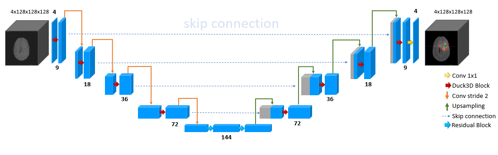
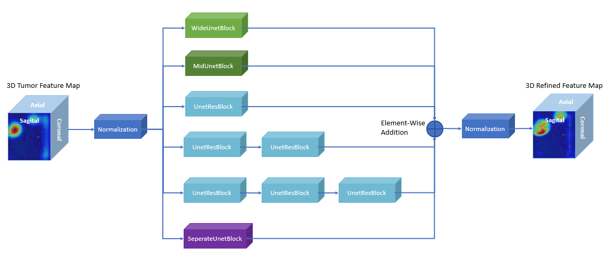

# Enhanced DynUNet for Brain Tumor Segmentation

## Introduction
This repository contains the implementation of the Enhanced DynUNet architecture, which integrates the Duck3D Block for improved brain tumor segmentation. Our method has been validated on the BraTS 2018 dataset, demonstrating superior performance in segmenting Whole Tumor (WT), Tumor Core (TC), and Enhancing Tumor (ET).

## Highlights
- **State-of-the-art Performance**: Achieves higher Dice scores compared to existing models.
- **Innovative Architecture**: Incorporation of the Duck3D Block enhances feature extraction capabilities.
- **Clinical Relevance**: Provides a reliable tool for aiding in the diagnosis and treatment planning of brain tumors.

## Model Overview


*Figure 1: Enhanced DynUNet Architecture Diagram*


*Figure 2: Duck3d Block overview*

The Enhanced DynUNet model incorporates multiple novel components:
- **Duck3D Block**: Enhances the model's ability to focus on relevant features within MRI scans.
- **Residual Blocks**: Implemented at various points to prevent gradient vanishing and ensure deep feature learning.
- **Multi-Scale Processing**: Facilitates accurate segmentation across different tumor regions.

## Results
Our method has been extensively tested and evaluated on the BraTS 2018 dataset, with results indicating substantial improvements over existing methods. Below are the comparative tables showcasing the performance of our enhanced DynUNet model against other state-of-the-art methods. These results highlight the effectiveness of our proposed improvements in the segmentation of brain tumors.

### Comparative Analysis 1: Overall Performance

*Figure 1: Comparative analysis of overall Dice scores across different methods.*

### Comparative Analysis 2: Impact of Duck3D Block

*Figure 2: Results showing the impact of integrating the Duck3D Block into the DynUNet architecture.*

### Comparative Analysis 3: Effect of Residual Blocks

*Figure 3: Performance differences resulting from varying the number of residual blocks at the bottleneck.*


## Dataset
The model was trained and validated on the BraTS 2018 dataset, which is publicly available for research purposes.

## Installation
To set up this project, clone the repository and install the required dependencies:
```bash
git clone https://github.com/khanhdat111/3D-DynUnet.git
cd 3D-DynUnet
pip install -r requirements.txt
